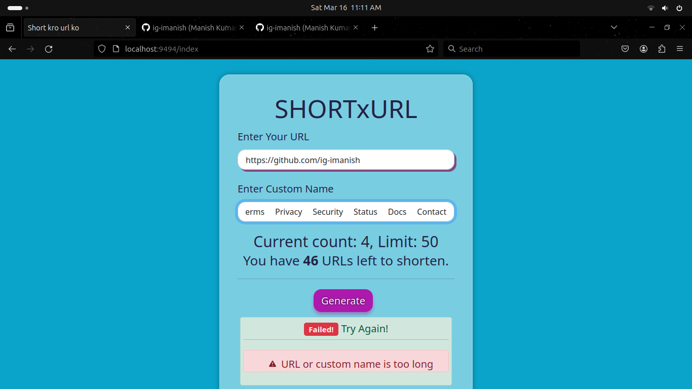
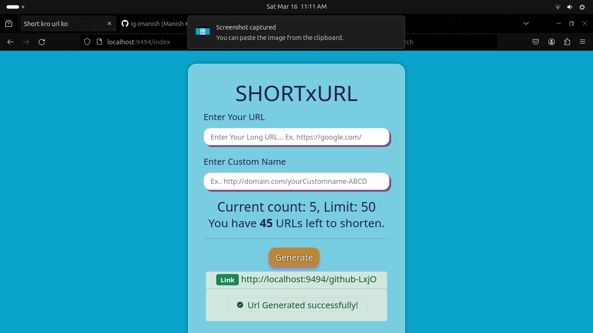
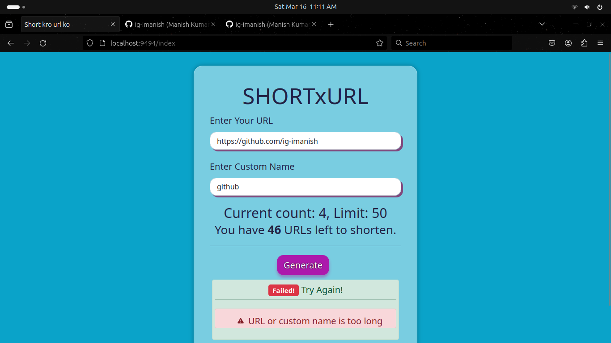

# Project Name

Description: [ a simple Spring boot project To short your Url!]

## Preview





[Demo Yt Video](https://youtu.be/mzomTiJcolI?feature=shared)
## Features

- [50 Url Per Client]
- [Beautiful UI]

## Installation
### Prerequisites

- Java JDK [21 version]
- Maven [3+]

### Clone
Clone this repository to your local machine using:

```bash
git clone https://github.com/ig-imanish/SHORTxURL.git
```

### Setup

1. Open project in your IDE
2. Run the project

## WARNING

1. [This is not for commercial purpose, project may contains Bug & Errors]
